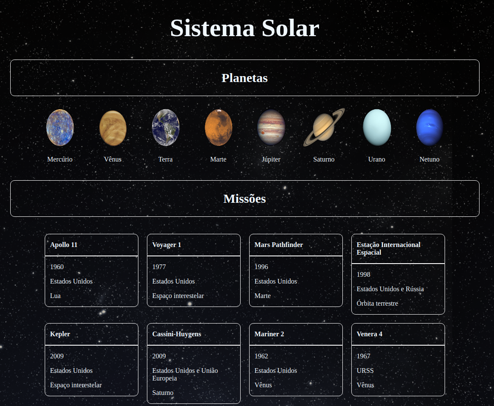

<h1 align="center">:ringed_planet: Solar System :ringed_planet:</h1>



## 📰 Sobre o projeto

Primeira aplicação em React desenvolvida no módulo de Frontend da Trybe. É possível visualizar todos os planetas do sistema solar renderizados na tela e as informações sobre missões espaciais. Nesse projeto aprendi a criar componentes de classe em React, utilizar props corretamente e fazer uso de PropTypes para validar as props.

---

## 🚀 Como executar o projeto

### Pré-requisitos

Antes de começar, você vai precisar ter instalado em sua máquina as seguintes ferramentas:
[Git](https://git-scm.com), [Node.js](https://nodejs.org/en/). 
Além disto é bom ter um editor para trabalhar com o código como [VSCode](https://code.visualstudio.com/)
<details>

```bash

# Clone este repositório
git clone git@github.com:jdgflorentino/projeto-solar-system.git

# Acesse a pasta do projeto no terminal/cmd
cd projeto-solar-system

# Instale as dependências
npm install

# Inicie a aplicação React
npm start

# A aplicação inciará na porta:3000 - acesse http://localhost:3000

</details>

## 🛠 Tecnologias

As seguintes ferramentas foram usadas na construção do projeto:
-  **[React](https://pt-br.reactjs.org/)**
-  **[CSS](https://developer.mozilla.org/pt-BR/docs/Web/CSS)**
